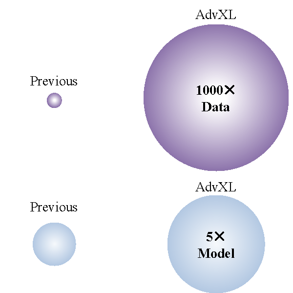

# Revisiting Adversarial Training at Scale

This is the official repository for our paper: "Revisiting Adversarial Training at Scale."

## Abstract:
The machine learning community has witnessed a drastic change in the training pipeline, pivoted by those ``foundation models'' with unprecedented scales. However, the field of adversarial training is lagging behind, predominantly centered around small model sizes like ResNet-50, and tiny and low-resolution datasets like CIFAR-10. To bridge this transformation gap, this paper provides a modern re-examination with adversarial training, investigating its potential benefits when applied at scale. Additionally, we introduce an efficient and effective training strategy to enable adversarial training with giant models and web-scale data at an affordable computing cost. We denote this newly introduced framework as AdvXL.

Empirical results demonstrate that AdvXL establishes new state-of-the-art robust accuracy records under AutoAttack on ImageNet-1K. For example, by training on DataComp-1B dataset, our AdvXL empowers a vanilla ViT-g model to substantially surpass the previous records of $l_{\infty}$-, $l_{2}$-, and $l_{1}$-robust accuracy by margins of **11.4%**, **14.2%** and **12.9%**, respectively. This achievement posits AdvXL as a pioneering approach, charting a new trajectory for the efficient training of robust visual representations at significantly larger scales. 

  

  

## Coming Soon!
We are preparing the code and models for release. Stay tuned!
